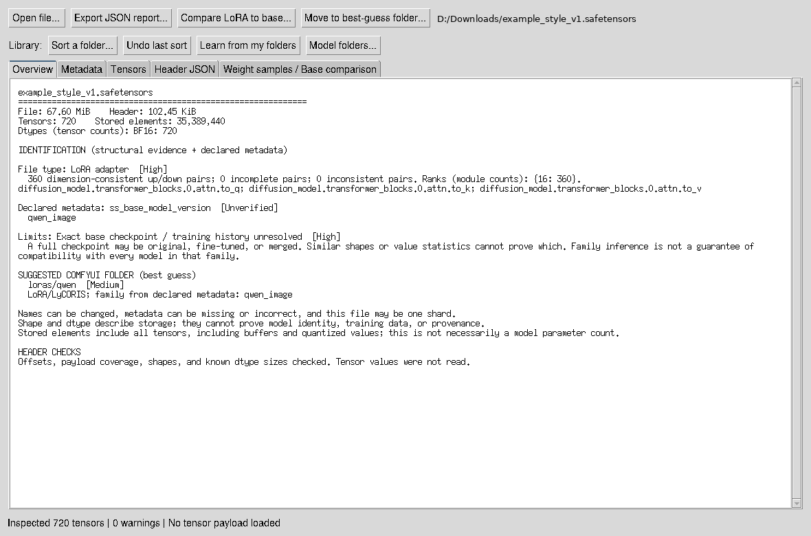

# Safetensors Inspector

**Find out what an unfamiliar `.safetensors` file is, and put it in the right ComfyUI folder.**

Downloaded a pile of models with names like `final_v3_fixed.safetensors`? Safetensors Inspector reads each file's header and tells you what it actually is (LoRA, VAE, text encoder, checkpoint, ControlNet, diffusion model) and which model family it belongs to (Flux 1/2, Qwen-Image, Wan, Krea 2, SDXL, SD 1.x, LTX, Z-Image, HunyuanVideo and more), with the evidence for each call. Then it can move the file, or a whole downloads folder, into the matching ComfyUI `models` subfolder.



- Offline: no network access, no uploads.
- Reads headers only; weights are loaded only when you ask for a sample.
- No dependencies: Python 3.10+ with Tkinter. No pip install, no PyTorch, no GPU.
- Learns from how you already organize your models, including custom-node folders.
- Moves never overwrite, and every folder sort can be undone.

## Start

Download or clone this repository. On Windows, double-click **Launch Inspector.bat**. Or run:

```powershell
python safetensor_inspector.py
python safetensor_inspector.py "D:\models\unknown.safetensors"
```

Keep `safetensor_inspector.py`, `tensor_detective.py` and `destination.py` in the same folder. Tkinter is normally included with Python on Windows. On Linux, your distribution may require its `python3-tk` package.

## Investigate a file

1. **Open file**. Overview reports likely file type, base-family candidates, confidence, and the exact evidence behind each result.
2. **Metadata** shows declared training/model information and expands JSON embedded in metadata strings.
3. **Tensors** lets you filter names, shapes, and dtypes; sort columns; inspect full descriptors and offsets; and copy details. Results are paginated in groups of 500.
4. Select a tensor and click **Sample weight values** to read actual payload values. The app reads up to 4,096 values from the beginning, middle, and end, showing finite min/max, mean, standard deviation, zero fraction, NaNs, infinities, and initial values. These are sampled statistics, not a full integrity scan. FP16, BF16, FP32, FP64, boolean and integer formats are supported; packed and FP8 decoding is not implemented.
5. For a LoRA, use **Compare LoRA to base** and select a candidate model/backbone. The app compares corresponding target shapes and lists matches, mismatches, and unresolved modules. Common Kohya and PEFT/Diffusers adapter names are recognized. Conversion between different architecture naming schemes is deliberately unresolved.
6. **Export JSON report** saves all descriptors, findings, and any completed samples/comparisons. Filtering does not restrict the export.

## Move to the best-guess ComfyUI folder

After a file is open, the Overview shows **SUGGESTED COMFYUI FOLDER** with a confidence and the reason. When the app cannot resolve a destination, the guess is low confidence, or the family clues conflict, a folder picker opens automatically. Select the folder to move the file there; Cancel leaves the file in place. The **Choose destination folder...** button lets you reopen the picker later. A folder choice is required before any uncertain file is moved.

For a supported guess, **Move to best-guess folder...** shows that guess (for example `D:\ComfyUI\models\loras\qwen`) and asks:

- **Yes**: move it there
- **No**: pick a different folder
- **Cancel**: do nothing

Moves never overwrite: if a file with the same name is already there, the file stays where it is. On the same drive a move is an instant rename. Between drives the file is copied with the operating system's own copy call and the original is deleted only after the size checks out; a `name.partial` file is used so an interrupted copy never leaves a half file under the real name. On Windows the copy call is `CopyFileExW`, which lets an SMB server copy between two of its own shares without sending the data through your PC, when the server supports it.

## Sort a whole folder

**Sort a folder...** takes a folder of downloads (top level only, unless **Include subfolders** is ticked; then every subfolder is searched too, anything already inside your model folders is skipped, and folder shortcuts are not followed), works out a destination for every `.safetensors` file in it, and shows the plan before moving anything:

- **Yes**: move every file that has a guess, including Low confidence
- **No**: move only Medium and High, leave Low where it is
- **Cancel**: move nothing

Files with no guess, or with conflicting family clues, always stay put. Pointing it at one of your model folders is refused, so it cannot reshuffle the library. Every sort writes a CSV log in `sort_logs\` beside the script, and **Undo last sort** moves everything in the latest log back where it came from.

Command line:

```powershell
python safetensor_inspector.py --sort "D:\Downloads" --dry-run --models-root D:\ComfyUI\models   # show the plan only
python safetensor_inspector.py --sort "D:\Downloads"               # move (includes Low confidence)
python safetensor_inspector.py --sort "D:\Downloads" --skip-low    # leave Low confidence in place
python safetensor_inspector.py --sort "D:\Downloads" --recursive   # also sort files in every subfolder
```

**Model folders...** sets two roots, saved in `inspector_settings.json` beside the script. The app asks for them the first time you move, sort or learn:

| Setting | Used for |
|---|---|
| models folder | your ComfyUI `models` folder (the one containing `loras`, `vae`, `checkpoints`...) |
| large models folder (optional) | files of 4 GB and over, e.g. a second drive listed in ComfyUI's `extra_model_paths.yaml`. Falls back to the models folder |

How the folder is chosen, first match wins:

| Detected | Folder |
|---|---|
| ControlNet | `controlnet` |
| LoRA / LyCORIS | `loras\<family>`: `qwen`, `Krea2`, `flux2`, `flux1`, `wan`, `ltx`, `zimage`, `sdxl` (or `loras` if the family is unknown) |
| Diffusion model bundled with VAE/text encoder | `checkpoints` |
| Diffusion model alone | `diffusion_models` (`FLUX`, `QWEN`, `WAN` subfolders when recognised) |
| VAE | `vae` |
| Text encoder (CLIP, T5/UMT5, Qwen/Llama/Gemma-style) | `text_encoders` |
| ESRGAN-style upscaler | `upscale_models` |
| Nothing recognised | closest match in your learned library, then filename keywords (`lora`, `vae`, `clip`, `t5xxl`, …), marked **Low** |

**Learn from my folders** reads the header of every `.safetensors` already in your model folders (headers only, seconds for hundreds of files) and saves each file's layer-pattern fingerprint to `library_index.json`. When the built-in rules do not recognise a file, the inspector finds the most similar file you have already sorted (at least 50% fingerprint overlap) and suggests its folder, e.g. "Layer pattern matches MelBandRoformer_fp32.safetensors already in unet (92% overlap)". This covers custom-node folders and models the rules do not know. Re-run it after you add new kinds of models. CLI: `python safetensor_inspector.py --learn` (or `--learn D:\ComfyUI\models E:\models`).

The family comes from declared metadata first, then the layer structure, then the filename. It is a best guess, not a guarantee; check Low-confidence guesses before relying on them.

Command line:

```powershell
python safetensor_inspector.py "D:\Downloads\x.safetensors" --suggest
python safetensor_inspector.py "D:\Downloads\x.safetensors" --move          # into the saved models folder
python safetensor_inspector.py "D:\Downloads\x.safetensors" --move D:\ComfyUI\models   # into an explicit root
```

## What the detector uses

- LoRA: actual up/down or A/B pairs with consistent rank dimensions, not simply the filename. Incomplete and inconsistent pairs are reported.
- LyCORIS: named low-rank, Hadamard, Kronecker, and OFT signatures (tentative).
- VAE: both encoder and decoder convolution structure, plus latent-channel dimensions. A four-channel VAE does not uniquely distinguish SD 1.x, SD 2.x, and SDXL; sixteen channels alone do not distinguish FLUX from SD3.
- Full diffusion weights: UNet down/up/time layer groups or recognized diffusion transformer streams. VAE/text-encoder groups distinguish a bundled checkpoint from standalone backbone weights.
- SD 1.x, SD 2.x, SDXL base/refiner: cross-attention K/V input widths, including those retained in LoRA down/A matrices. Conflicting widths are surfaced.
- FLUX: paired dual/single-stream groups, with projection dimensions providing additional FLUX.1 evidence. SD3-style joint image/context streams are recognized tentatively.
- Inpainting: nine-channel UNet input convolution. ControlNet: conditioning-specific groups, including FLUX-style `controlnet_blocks`.
- Newer transformers (tentative): Qwen-Image (`transformer_blocks` + `img_mod`), Wan 2.x (cross/self attention + `patch_embedding`), Krea 2 (`attn.qknorm` + `mod.lin`), Z-Image/Lumina (`cap_embedder`/refiners), LTX (`adaln_single`/audio), HunyuanVideo (`individual_token_refiner`).
- Text encoders: CLIP `text_model`, T5/UMT5 `encoder.block`, and LLM-style `model.layers` + `embed_tokens` (Qwen, Llama, Gemma).

Confidence describes rule strength, not a calibrated probability. The rules target common diffusion formats; they do not cover every architecture or exporter. The app reports unknown rather than inventing an exact identity. An adapter that only targets shared/self-attention or text-encoder layers may not reveal its base family. A single shard may lack identifying layers.

“Base model” can mean an architecture family or the exact original checkpoint. Shapes can support the first. They cannot establish whether full weights are original, fine-tuned, or merged, or identify a particular training checkpoint. Metadata is shown as an unverified declaration. Raw weight statistics cannot establish provenance either. Matching a LoRA's shapes is necessary but not sufficient for runtime compatibility.

The initial scan reads tensor descriptors and validates offsets, sizes, and coverage without loading the payload. Structural identification uses the tensor inventory in those descriptors, even when user metadata is absent. Actual payload reads happen only when you request a sample. All processing is offline and source files are opened read-only.

## CLI and checks

```powershell
python safetensor_inspector.py "D:\models\unknown.safetensors" --json
python -m unittest -v test_inspector.py
```

Header size is capped at 100 MB. Unknown future dtypes are listed with a warning; their byte-size relationship cannot be verified. Header JSON in the GUI is reconstructed and limited to two million display characters; the report includes the full tensor inventory.

## Rule references

- Format: https://github.com/safetensors/safetensors#format
- SD 1.x conditioning dimensions: https://huggingface.co/stable-diffusion-v1-5/stable-diffusion-v1-5/blob/main/unet/config.json
- SDXL conditioning dimensions: https://huggingface.co/stabilityai/stable-diffusion-xl-base-1.0/blob/main/unet/config.json
- SDXL refiner: https://huggingface.co/stabilityai/stable-diffusion-xl-refiner-1.0/blob/c35c0a09709f882f9a4028007130e39cc75df399/unet/config.json
- FLUX layer layout and dimensions: https://github.com/black-forest-labs/flux/blob/main/src/flux/model.py and https://github.com/black-forest-labs/flux/blob/main/src/flux/util.py
- Common LoRA naming conversions: https://github.com/huggingface/diffusers/blob/main/src/diffusers/loaders/lora_conversion_utils.py

## Contributing

Detection rules live in `tensor_detective.py` and folder mapping in `destination.py`. If a file is misidentified, open an issue with the output of `python safetensor_inspector.py yourfile.safetensors --json` (it contains tensor names and shapes only, no weights). Run the tests with `python -m unittest -v test_inspector.py`.

## License

[MIT](LICENSE)
